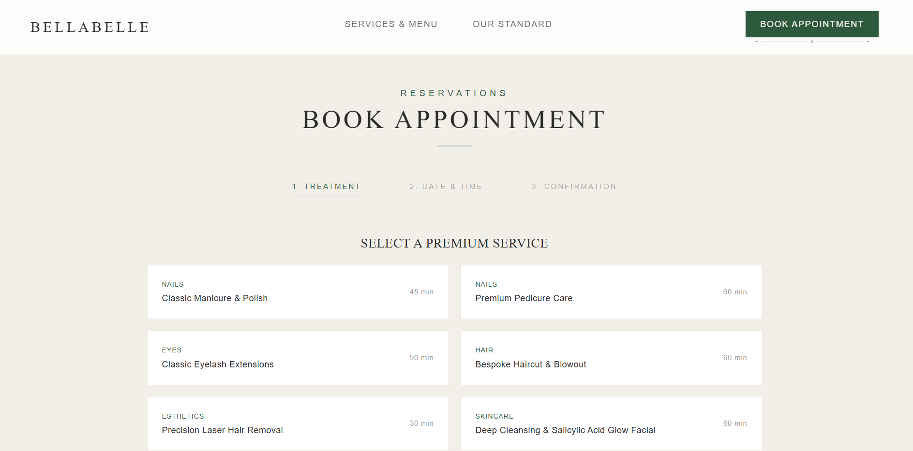
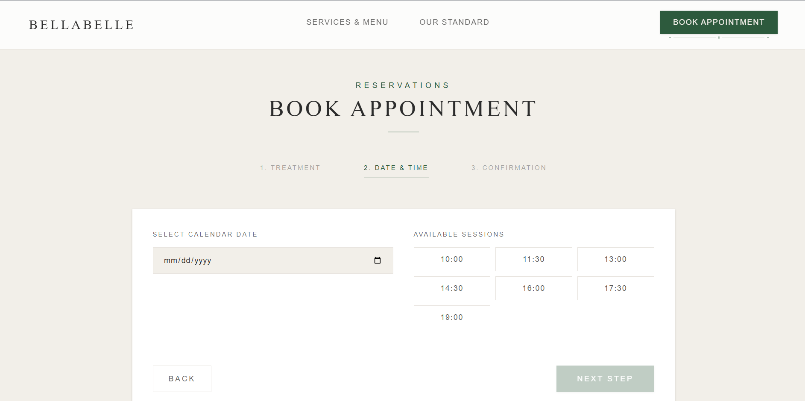
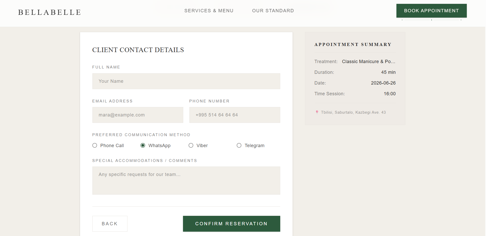
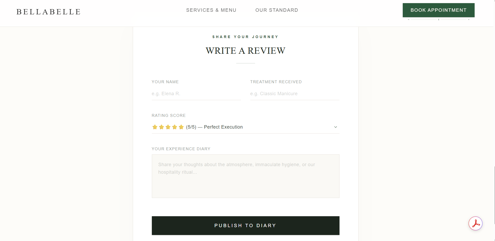
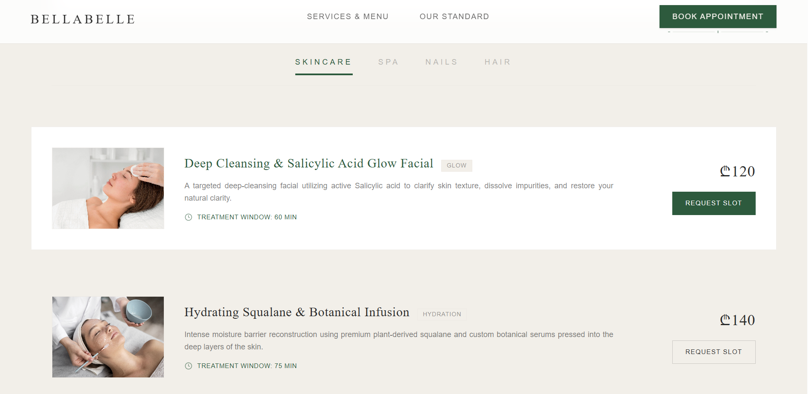

# 🌿 Beauty Salon — Booking & Services App
 
A full-stack beauty salon web application built with **Next.js** and **Supabase**. Clients can browse treatments, book appointments, and leave reviews — all with a polished editorial aesthetic inspired by luxury wellness brands.
 
> Built for a real salon in Tbilisi, Georgia 📍
 
---
 
 
 
 
 
 
## ✨ What It Does
 
### Browse Treatments (`/services`)
Clients can explore the full treatment menu across four categories — **Skincare, Spa, Nails, and Hair**. The page includes a live smart filter panel:
- 🔍 Text search by treatment name or description
- 🎯 Filter by skin/body concern (glow, hydration, exfoliation, tension relief, grooming)
- ⏱️ Duration slider to find treatments that fit their schedule
- Each treatment card shows a photo, description, duration, and price — with a direct link to book
### Book an Appointment (`/book`)
A guided 3-step booking wizard:
1. **Pick a treatment** from the full service grid
2. **Choose a date and time** from available slots (10:00–19:00)
3. **Fill in contact details** — name, email, phone, and preferred contact method (Phone, WhatsApp, Viber, or Telegram)
On submission, the booking is saved to Supabase with a `pending` status, ready for the admin to confirm. The client sees a confirmation screen with their appointment summary.
 
### Standards & Reviews (`/standards`)
An editorial brand page with two purposes:
- Showcases the salon's **three core standards** (hygiene, certified mastery, the coffee & conversation ritual)
- Displays **verified guest reviews** fetched live from the database — only admin-approved ones appear publicly
- Guests can submit their own review (name, treatment, rating 1–5, written experience), which enters a moderation queue
- Each review card has a **like button** that increments live in the database
---
 
## 🛠️ Tech Stack
 
| Layer | Technology |
|---|---|
| Framework | Next.js 14 (App Router) |
| Language | TypeScript |
| Database | Supabase (PostgreSQL) |
| Auth/Storage | Supabase Storage (images) |
| Styling | Tailwind CSS |
| Hosting | Vercel (recommended) |
 
### Custom Tailwind Design Tokens
The UI uses a consistent luxury color palette defined as custom tokens:
 
| Token | Usage |
|---|---|
| `forest` | Primary brand green (`#3D5A45`) |
| `near-black` | Body text (`#1C251D`) |
| `cream` | Borders and dividers (`#E6E1DA`) |
| `off-white` | Page background (`#FDFCF9`) |
| `deep-green` | Button hover state |
 
---
 
## 🗄️ Database Schema
 
### `bookings`
Stores appointment requests submitted through the booking wizard.
 
| Column | Type | Notes |
|---|---|---|
| `id` | uuid | Auto-generated |
| `client_name` | text | |
| `client_email` | text | |
| `treatment` | text | Service name |
| `booking_date` | date | |
| `booking_time` | text | e.g. `"14:30"` |
| `status` | text | Defaults to `"pending"` |
| `created_at` | timestamp | Auto-generated |
 
### `reviews`
Stores guest reviews with admin moderation gating.
 
| Column | Type | Notes |
|---|---|---|
| `id` | uuid | Auto-generated |
| `author` | text | |
| `treatment` | text | |
| `rating` | int | 1–5 |
| `text` | text | Review body |
| `likes` | int | Defaults to `0` |
| `is_approved` | bool | Set by admin — only `true` reviews are public |
| `created_at` | timestamp | Auto-generated |

 ## 🚀 Getting Started
 
```bash
# Install dependencies
npm install
 
# Start the dev server
npm run dev
